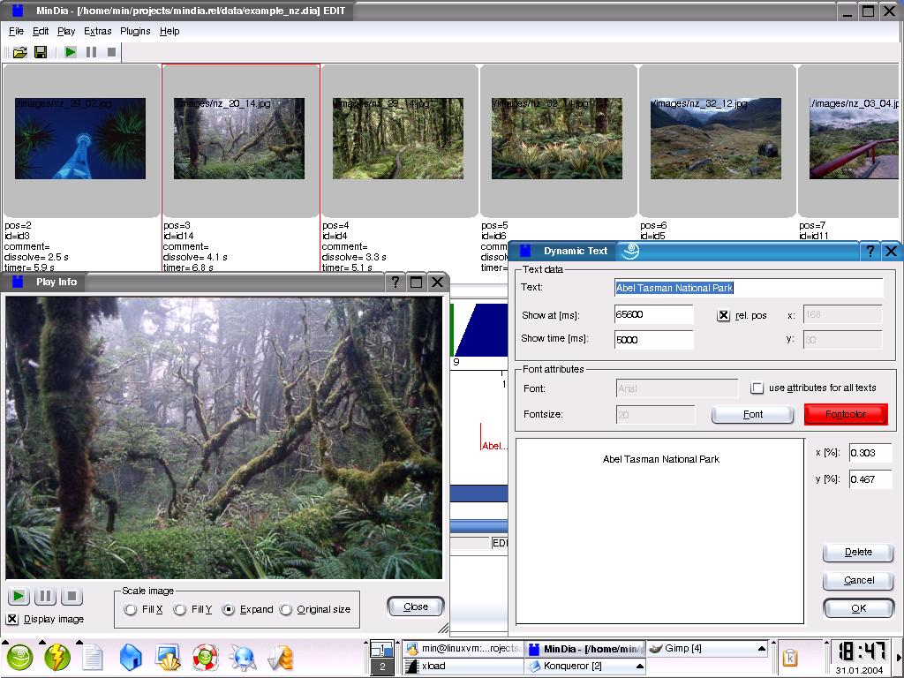

## MinDia is a program to create, modify and run multimedia slide shows on a computer

This is an application to make multimedia slide shows on a computer.
There is also support to make presentations with rollei projectors.
The following models are supported: "Rolleivision 35 twin digital P"
and "Rolleivision twin msc 3x0 P". 



This application works fine with my dia projector, which is twenty years old.
But there is only limited testing done with the newer versions of the 
Rollei-projectors.

For further information please read the html-documentation.

- [Documentation in german language](src/mindia_de.html)
- [Documentation in english language](src/mindia_en.html)

or visit the [project homepage](http://mindia.sourceforge.net) 
or the [source code repository](https://github.com/mneuroth/MinDia)

### Supported platforms  
This program is written in C++ with the Qt framework. It runs on GNU/Linux, 
Mac OSX and Windows. 
* Windows [](https://ci.appveyor.com/project/mneuroth/MinDia)
* MacOS and Linux [](https://travis-ci.org/mneuroth/MinDia) 

### Building from source  
* You can either open project with QtCreator and press the Build button
* Or build it using a terminal:
``` 
qmake -r mindia.pro
make
```

### License
The program is released under the GPL, see the file COPYING for details.

